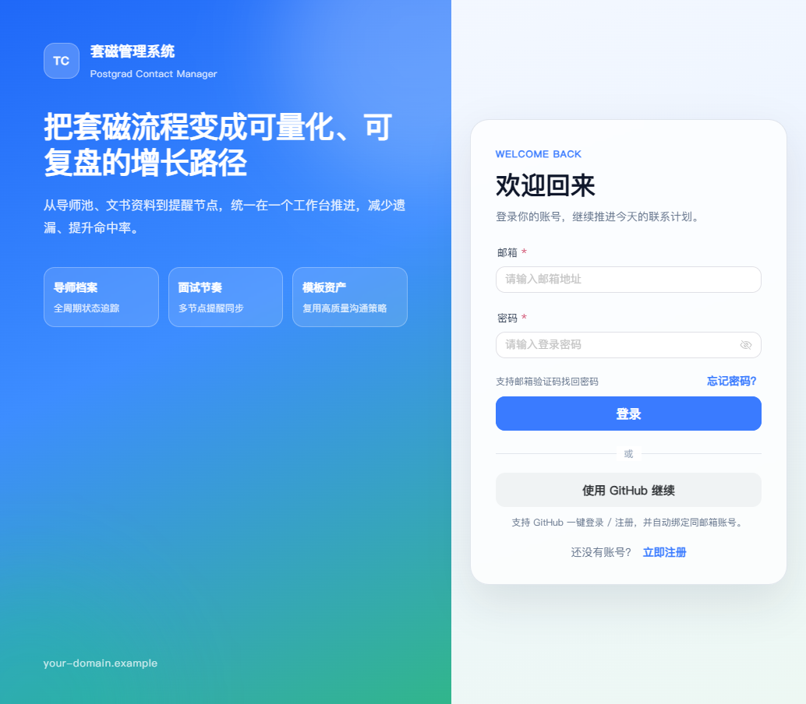
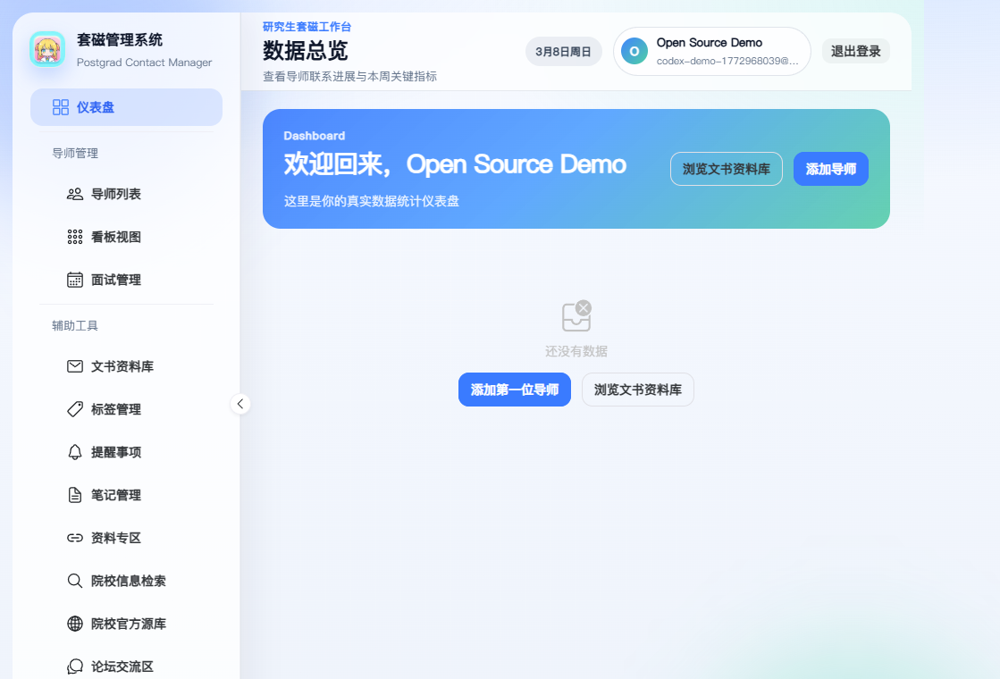
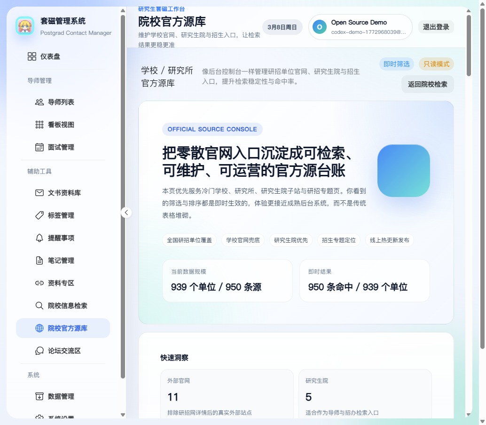
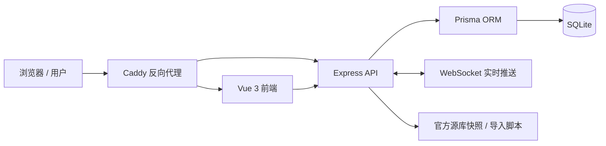

<div align="center">
  
  <h1>研究生复试套磁管理系统</h1>
  <p><strong>Postgrad Contact Manager</strong></p>
  <p>面向保研 / 考研 / 复试场景的导师联系、文书资料管理、院校检索与协同工作台。</p>

  <p>
    <a href="https://2320194668.cn"></a>
    <a href="https://github.com/wzyn20051216/postgrad-contact-manager/actions/workflows/ci.yml"></a>
    <a href="https://github.com/wzyn20051216/postgrad-contact-manager/releases"></a>
    <a href="./LICENSE"></a>
    <a href="https://github.com/wzyn20051216/postgrad-contact-manager/issues"></a>
    <a href="https://github.com/wzyn20051216/postgrad-contact-manager/discussions"></a>
    <a href="https://github.com/wzyn20051216/postgrad-contact-manager/stargazers"></a>
    <a href="https://github.com/wzyn20051216/postgrad-contact-manager/network/members"></a>
  </p>

  <p>
    
    
    
    
    
    
  </p>

  <p>
    <a href="https://2320194668.cn">在线使用</a> ·
    <a href="./DEPLOY.md">部署文档</a> ·
    <a href="./docs/architecture.md">架构说明</a> ·
    <a href="./docs/releases/v0.1.0.md">发布说明</a> ·
    <a href="./CONTRIBUTING.md">贡献指南</a> ·
    <a href="./SUPPORT.md">支持与反馈</a> ·
    <a href="./CODE_OF_CONDUCT.md">社区公约</a> ·
    <a href="./SECURITY.md">安全策略</a>
  </p>
</div>

> 在线体验：<https://2320194668.cn>  
> 相关交流可联系 QQ：`2320194668`，请注明来自 GitHub。项目仍在持续完善中，请多指教。

## 项目概述

研究生复试套磁管理系统是一个围绕“导师联系 + 材料准备 + 院校调研 + 进度协同”构建的全流程工具。它试图解决传统表格、备忘录、聊天记录、浏览器收藏夹和本地文件夹分散导致的几个典型问题：

- 导师信息分散，难以形成可复用的联系档案
- 联系节奏缺少统一看板，容易遗漏关键节点
- 文书、资料、笔记散落在多个文件夹，难搜索、难复盘
- 学校与研究所信息收集成本高，缺少稳定的官方源沉淀
- 多轮准备中缺少统一的讨论区、提醒机制与数据导入导出能力

项目默认以个人或小团队自托管为目标，优先保证：

- 本地可快速启动
- 单机服务器可稳定部署
- Docker 部署简单
- 日常迭代支持免重建热发布

## 在线使用

- 正式地址：[https://2320194668.cn](https://2320194668.cn)
- 当前仓库对应的公开可用实例，适合直接体验主要功能与界面流程
- 如果你希望自己部署，请继续阅读下方的环境、部署与运维文档

## 为什么开源

- 将保研 / 考研场景下高度碎片化的信息管理流程沉淀为可复用工具
- 提供一个可二次开发的教育信息管理型 Web 应用基座
- 方便个人部署、小团队协作，以及在低成本服务器上持续迭代

## 界面预览

| 登录页 | 工作台 |
| --- | --- |
|  |  |
| 认证入口、品牌展示、邮箱 / GitHub 登录流程 | 仪表盘、后台工作台布局与核心入口聚合 |



_院校官方源库页面：偏后台控制台风格的筛选、洞察与检索体验。_

## 功能矩阵

| 模块 | 说明 |
| --- | --- |
| 身份认证 | 支持邮箱注册、邮箱验证码找回密码、GitHub OAuth 登录 / 注册 |
| 导师管理 | 维护导师基础资料、研究方向、联系状态、详情页与编辑流程 |
| 看板与统计 | 支持流程看板、阶段追踪、数据统计与复盘视图 |
| 面试管理 | 管理面试安排、面试记录、过程复盘与后续动作 |
| 标签 / 模板 | 支持标签分类、模板沉淀与复用型沟通策略管理 |
| 笔记 / 文书编辑 | 支持 Markdown 风格在线编辑，适合沉淀简历、联系记录、准备笔记 |
| 资料专区 | 支持资料收集、分类管理、检索与在线查看 / 编辑 |
| 院校检索 | 支持学校 / 研究所搜索，以及“官方源库”快照恢复 |
| 论坛协同 | 支持交流讨论、实时推送与 @ 提醒类能力 |
| 数据与部署 | 支持数据导入导出、Docker Compose 部署、Caddy HTTPS、热发布 |

## 适用场景

- 个人保研 / 考研期间，统一管理导师联系与材料准备
- 小范围协作团队，沉淀导师、学校与文书资料资产
- 需要自托管部署的教育信息管理类项目原型
- 希望在低成本服务器上快速上线并持续迭代的 Web 应用

## 架构总览



更完整的模块职责、数据流和部署边界说明见：[docs/architecture.md](./docs/architecture.md)

## 技术栈

### 前端

- Vue 3
- TypeScript
- Vite
- Naive UI
- UnoCSS
- Pinia
- Vue Router

### 后端

- Node.js
- Express
- TypeScript
- Prisma ORM
- SQLite
- WebSocket

### 工程与部署

- pnpm workspace
- Docker / Docker Compose
- Caddy
- Prisma Migration
- 自定义热发布脚本
- GitHub Actions CI

## 项目结构

```text
postgrad-contact-manager/
├─ packages/
│  ├─ client/         # Vue 3 前端应用
│  ├─ server/         # Express + Prisma 后端服务
│  └─ shared/         # 前后端共享类型 / 工具
├─ prisma/            # 数据模型与迁移相关文件
├─ scripts/           # 构建、导入、验收、热发布脚本
├─ deploy/            # 反向代理等部署配置
├─ docs/              # 架构说明、发布说明、截图等文档资产
├─ .github/           # CI、Issue Template、PR Template、Dependabot 配置
├─ docker-compose.yml # 生产部署编排
├─ README.md
├─ DEPLOY.md
├─ SUPPORT.md
└─ CHANGELOG.md
```

## 快速开始

### 1. 环境要求

- Node.js >= 18
- pnpm >= 8
- 建议使用 Git 与现代浏览器进行开发

### 2. 本地开发

```bash
# 1) 克隆仓库
git clone <your-repo-url>
cd postgrad-contact-manager

# 2) 复制环境变量模板
cp .env.example .env

# Windows PowerShell 可使用
Copy-Item .env.example .env

# 3) 安装依赖
pnpm install

# 4) 执行数据库迁移
pnpm db:migrate

# 5) 启动前后端开发环境
pnpm dev
```

默认访问地址：

- 前端：`http://localhost:5173`
- 后端健康检查：`http://localhost:3000/api/health`

### 3. 常用脚本

| 命令 | 说明 |
| --- | --- |
| `pnpm dev` | 同时启动前后端开发服务 |
| `pnpm build` | 构建 shared / client / server |
| `pnpm lint` | 执行 ESLint 检查 |
| `pnpm db:migrate` | 执行本地数据库迁移 |
| `pnpm db:studio` | 打开 Prisma Studio |
| `pnpm import:graduate-school-sources` | 在线抓取研招单位官方源 |
| `pnpm import:graduate-school-sources:snapshot` | 从项目快照恢复官方源 |
| `pnpm verify:domain -- <domain>` | 验证域名解析、HTTPS 与跳转状态 |

## 部署与运维

### Docker Compose 部署

项目默认提供基于 Docker Compose 的生产部署方案，适合单机自托管：

```bash
docker compose up -d --build
```

默认包含：

- `app`：Node.js 应用服务
- `caddy`：反向代理与 HTTPS 证书管理

更完整的部署说明见：[DEPLOY.md](./DEPLOY.md)

### 免重建热发布

当你仅修改前端静态资源、后端构建产物或脚本时，可以优先使用热发布链路，而不是每次都重建镜像：

```bash
pnpm deploy:hot:init
pnpm deploy:hot:client
pnpm deploy:hot:server
pnpm deploy:hot:all
pnpm deploy:hot:check
```

热发布适用场景：

- 前端页面、样式、交互更新
- 后端 TypeScript 逻辑更新
- Prisma 脚本、导入脚本、部署脚本调整
- 运行配置联动刷新

## 数据说明

### 默认数据库

- 默认使用 SQLite
- 开发与单机部署门槛低
- 适合个人使用与小规模协作场景

### 官方源库快照

项目内置“学校 / 研究所官方源库”快照恢复能力，适合低内存服务器：

```bash
pnpm import:graduate-school-sources:snapshot
```

默认快照位置：

```bash
scripts/data/graduate-school-sources.snapshot.json
```

## 社区与支持

- 使用问题、部署交流、经验分享：优先进入 [GitHub Discussions](https://github.com/wzyn20051216/postgrad-contact-manager/discussions)
- 可稳定复现的缺陷：提交 [Bug Report](https://github.com/wzyn20051216/postgrad-contact-manager/issues/new/choose)
- 新功能或体验建议：提交 [Feature Request](https://github.com/wzyn20051216/postgrad-contact-manager/issues/new/choose)
- 安全漏洞：先阅读 [SECURITY.md](./SECURITY.md)，不要在公开 Issue 中直接披露细节
- 如果你更习惯即时沟通，也欢迎通过 QQ：`2320194668` 交流使用反馈、部署经验或产品建议，请注明来意。项目仍在持续完善中，请多指教。

详细支持说明见：[SUPPORT.md](./SUPPORT.md)

## 公开版本说明

本仓库的公开版本已做以下处理：

- 移除服务器 IP、SSH 凭据、私有部署记忆等敏感信息
- 将公开文档中的域名、邮箱、健康检查地址替换为示例值或公共入口
- 忽略本地 `.env`、热发布本地配置、Agent 文件与临时测试文件
- 保留完整的本地开发、Docker 部署与热发布链路

这意味着你克隆后可以直接二次开发，但部署前需要把示例配置替换成你自己的真实值。

## Roadmap

- [x] 邮箱登录 / 注册 / 重置密码
- [x] GitHub OAuth 登录
- [x] 导师管理、标签、模板、面试与统计
- [x] 文书 / 笔记在线编辑
- [x] 资料专区与官方源库管理
- [x] 论坛与提醒协同能力
- [x] Docker Compose + Caddy + 热发布
- [ ] 更系统的自动化测试覆盖
- [ ] 更细粒度的权限与协作能力
- [ ] 更多可插拔存储与搜索能力

## Contributing

欢迎提交 Issue 和 Pull Request。

建议贡献流程：

1. Fork 仓库并创建特性分支
2. 保持改动聚焦，避免混入无关重构
3. 提交前运行：

```bash
pnpm lint
pnpm build
```

开始贡献前，建议先阅读：[CONTRIBUTING.md](./CONTRIBUTING.md)

## License

本项目基于 [MIT License](./LICENSE) 开源。向本项目提交代码即表示你同意你的贡献在该许可证下发布。
